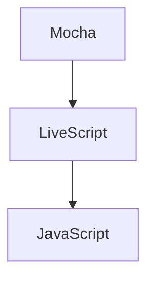

# История JS
1995 год. Создание нового легкого скриптового языка

```mermaid {scale: 1.5}
flowchart TB
    Mocha["Mocha"]
    LiveScript["LiveScript"]
    JavaScript["JavaScript"]
    
    Mocha --> LiveScript
    LiveScript --> JavaScript
```

